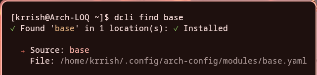
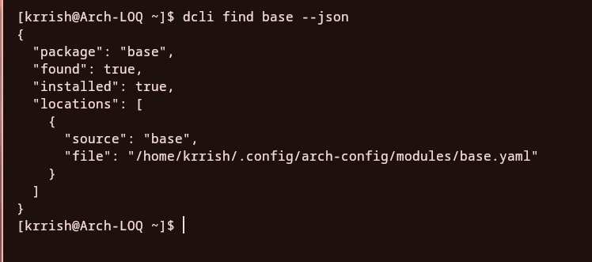

### Package Management

```bash
dcli search
```

The `dcli search` command provides a beautiful TUI interface powered by fzf.


#### Finding Packages in Your Config

```bash
dcli find vim
dcli find firefox --json
```

The above mentioned command `dcli find <package_name>` can be used to find a packages listed in your config, as depicted below.



And the command `dcli find <package_name> --json` can be used to display a JSON output for scripting.



Demo Text!